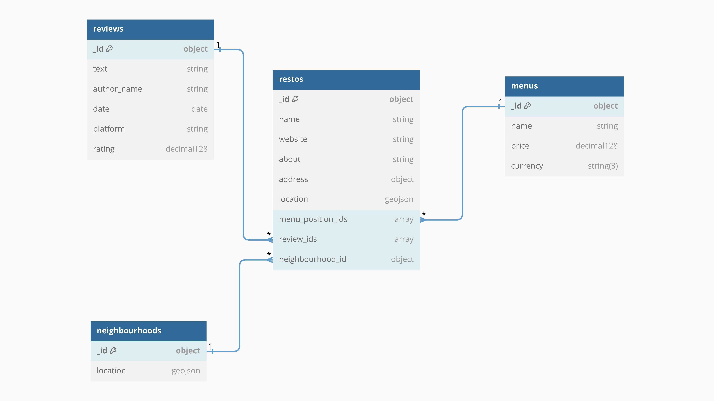
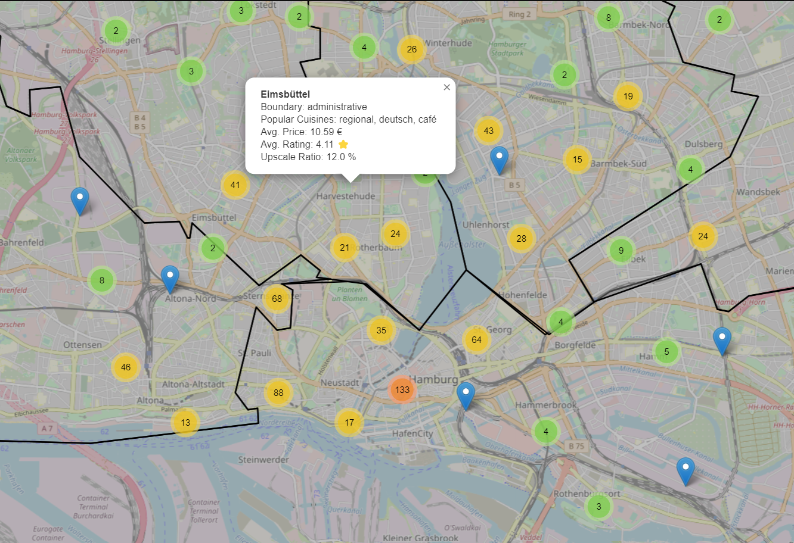
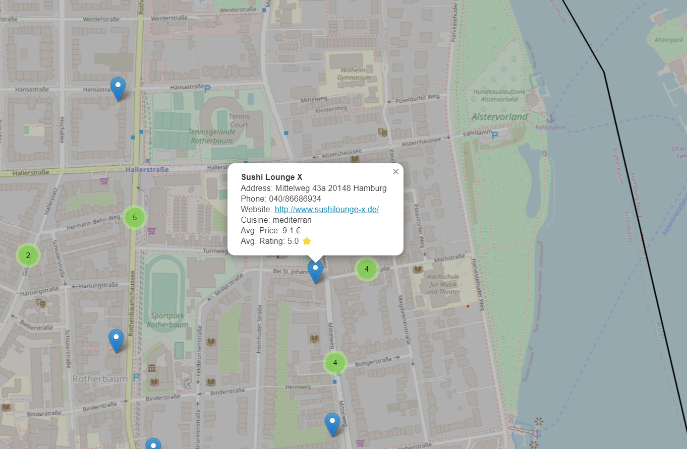

```{r setup, include=FALSE}
knitr::opts_chunk$set(echo = FALSE, cache=FALSE, messages=FALSE, warning=FALSE, 
                      attr.source='.numberLines', singlespacing = TRUE)
fhswf::fhswf_hooks()

# Load Packages
library(fhswf)
library(jsonlite)
```

# Einführung & Motivation

Im vorliegenden wird das Projekt „Gastronomic Intelligence Hub" (GIH) vorgestellt. Das Web-Mining-Projekt konzentriert sich auf die Analyse öffentlicher Daten von gastronomischen Unternehmen innerhalb Deutschlands.

Mit der steigenden Vielfalt in der Gastronomiebranche wird es umso wichtiger, die Gründungsentscheidung faktenbasiert zu treffen. Ob für die Analyse des Marktes, des Wettbewerbs oder des Standorts - diese Lösung wird den Gründungsinteressierten bei all diesen Aspekten zur Seite stehen.

Das Ziel des Projektes ist es, ein ganzheitliches Verständnis über die Gastronomielandschaft in Deutschland zu gewinnen. Um dies zu erreichen, werden öffentliche Daten aus verschiedenen Informationsquellen gesammelt und analysiert, sodass fundierte Erkenntnisse gewonnen werden können.

Hierzu werden Web Mining Techniken eingesetzt, die Informationen über Restaurants, Cafés, Bars und andere gastronomische Betriebe liefern. Dies umfasst Informationen wie Standorte, Öffnungszeiten, Bewertungen, Speisekarten und ähnliches.

Die Plattform ermöglicht nicht nur eine detaillierte Auswertung der Daten, sondern stellt auch Werkzeuge zur Verfügung, mit deren Hilfe diese visualisiert und interpretiert werden können. Auf diese Weise können angehende Restaurantunternehmer, Investoren oder Marktforscher qualifizierte Entscheidungen treffen.

Nachfolgend werden die verschiedenen Aspekte des Projekts, insbesondere die Datenquellen, Analysetechniken und geplanten Funktionalitäten näher erläutert.

Das Projekt lässt sich lokal reproduzieren, den Code und Anweisungen für Setup sind auf [GitHub](https://github.com/vladislabv/gastronomic-intelligence-hub) zu finden.

# Datenerfassung

Scrapy ist ein leistungsstarkes Python-Paket, welches zum Web-Crawling und Web-Scraping verwendet wird. Es ermöglicht das automatische Durchsuchen und Extrahieren von Informationen aus Websites. [@scrapyPy] Die Stärken von Scrapy liegen in seiner Effizienz, Skalierbarkeit und Flexibilität. Scrapy bietet ein robustes Framework für die Verarbeitung von HTTP-Anfragen, ermöglicht paralleles Crawling und die Extraktion strukturierter Daten. Mithilfe der umfangreichen Dokumentation und aktiven Community ist Scrapy eine beliebte Wahl für komplexe Web-Scraping-Projekte.

Zusätzlich fand dieses Paket auch in unserem Projekt Anwendung zur Datensammlung und zur ersten Datenverarbeitung.

## Scraper-Aufbau

Die Struktur enthält verschiedene Dateien und Ordner für das Scrapy-Projekt:

-   scrapy.conf: Hier werden Framework-Konfigurationen und Umgebungsvariablen verwaltet.

-   webscraper:

    -   items.py: Beschreibt die grundlegenden Strukturen der Items.
    -   itemsloaders.py: Enthält Bereinigungspipelines für den aus HTML extrahierten Content.
    -   middlewares.py: Beinhaltet die WayBackMachine für den Webarchive Scraper.
    -   pipelines.py: Stellt eine Verbindung zu MongoDB her und enthält Pipelines für die lokale Datenarchivierung (Dateien/Bilder).
    -   processors.py: Beinhaltet benutzerdefinierte MongoDB-Funktionen, um Dokumente für den Import vorzubereiten. Dies ist hauptsächlich für die Erstellung von Cross-Verweisen notwendig.
    -   settings.py: Enthält die Einstellungen von Scrapy.
    -   utils.py: Hier befinden sich nützliche Funktionen wie Telefonnummer-Extraktor und Datumsformatierer.
    -   init.py: Initialisierungsdatei für das Modul.

-   spiders:

    -   restos.py: Scrapy Spider für speisekarte.de, golocal.de und yelp.de.
    -   webarchive.py: Scrapy Crawler für (historische Snapshots von) Websites.
    -   init.py: Initialisierungsdatei für das Modul.

Diese Struktur organisiert das Projekt und ermöglicht eine effiziente Entwicklung und Verwaltung der Web-Scraping-Anwendung

## Übersicht der Quellenstrukturen & Webmining-Prozessen

Wie bereits in den vorherigen Abschnitten dargelegt, haben wir beschlossen, die Website [www.speisekarte.de](http://www.speisekarte.de) als Hauptquelle zu nutzen. Einer der Vorteile ist, dass das Portal das Scraping durch Bots grundsätzlich gestattet, wie aus der robots.txt-Datei zu ersehen ist. Hinzu kommt, dass die Struktur der Website durch das XML-Schema transparent ist. Dies vereinfacht vor allem die Suche nach relevanten Informationen, im vorliegenden Fall die Metadaten von Restaurants (nach Städten) sowie die dazugehörigen Speisekarten und Bewertungen.

Beispiel von dem XML-Baum:

```{r echo=FALSE}
cat('<urlset xmlns="http://www.sitemaps.org/schemas/sitemap/0.9">
  <url>
    <loc>https://www.speisekarte.de/n%C3%BCrnberg/restaurants</loc>
    <lastmod>2023-09-17</lastmod>
    <changefreq>monthly</changefreq>
    <priority>0.8</priority>
  </url>
  <url>
    <loc>https://www.speisekarte.de/f%C3%BCrth/restaurants</loc>
    <lastmod>2023-09-17</lastmod>
    <changefreq>monthly</changefreq>
    <priority>0.8</priority>
  </url>
  ...
</urlset>')
```

Der Python-Skript `restos.py` implementiert eine Scrapy-Spider-Klasse mit den Namen RestosSpider, die entwickelt wurde, um Restaurantinformationen von verschiedenen Websites zu extrahieren. Es wird eine Sitemap der Website "speisekarte.de" verwendet, um die Restaurantseiten zu finden. Für jede gefundene Seite werden die Informationen über das Restaurant extrahiert und verarbeitet.

Dieser Vorgang beginnt damit, dass die Spider die Startseiten der Restaurants durchsucht. Dabei werden URLs von Restaurants auf "speisekarte.de" identifiziert und für die weitere Verarbeitung gesammelt. Anschließend wird jede dieser URLs aufgerufen, um die detaillierten Informationen zu den Restaurants zu sammeln. ([Beispielseite](https://www.speisekarte.de/berlin/restaurants))

Die `RestoLoader`-Klasse wird verwendet, um die extrahierten Daten des Restaurants zu strukturieren und zu bereinigen. Hierbei werden Informationen wie Name, Beschreibung, Website, Küchenarten, soziale Medien, Telefonnummer, Öffnungszeiten und Adresse des Restaurants erfasst.

Besonders interessant ist die Implementierung für `Yelp`. Hier greift Spider auf die interne API von Yelp zu, um zusätzliche Bewertungen zu sammeln. Dies geschieht mithilfe der Methode `parse_yelp_api_response`. Dabei wird die JSON-Antwort von Yelp verarbeitet, um Bewertungen, Datum, Autor und andere relevante Informationen zu extrahieren.

Nachdem die Metadaten gesammelt wurden, setzt Spider die Verarbeitung fort, indem es Informationen zu den Menüs der Restaurants sammelt. Hierzu navigiert Spider auf die entsprechenden Seiten der Speisekarten und extrahiert Details wie die Namen der Gerichte, Preise, Währungen, Beschreibungen und Kategorien.

Schließlich werden auch Bewertungen von verschiedenen Quellen gesammelt. Zuerst werden die Bewertungen von speisekarte.de selbst extrahiert. Anschließend werden Anfragen an die APIs von Yelp und golocal.de gesendet, um zusätzliche Bewertungen zu erhalten.

Die gescrapten Objekte aus der Website werden unter den folgenden Items gespeichert:

1.  `Resto` repräsentiert ein Restaurant und enthält Informationen wie Name, Webseite, Küchentypen uvm. Es dient als Container für die gesammelten Daten eines Restaurants.

2.  `RestoAddress` speichert die Adresse eines Restaurants in den Feldern Straße, Postleitzahl und Stadt.

3.  `RestoLocation` beinhaltet Informationen zur geografischen Lage eines Restaurants, inklusive des Typs und der Koordinaten.

4.  `RestoHours` erfasst die Öffnungszeiten des Restaurants für verschiedene Wochentage.

5.  `Menu` ist zuständig für die Speisekarte, inklusive Name, Preis, Währung, Beschreibung und Kategorie der Gerichte.

6.  `Review` enthält Informationen zu Restaurantbewertungen, wie Datum, Bewertung, Titel, Text und Autor.

7.  `RestoHistory` speichert die historischen Daten der Restaurants, einschließlich der URL, dem Zeitpunkt des Schnappschusses und dem Zeitpunkt der Erfassung.

8.  `WebFile` ermöglicht das Herunterladen von Dateien aus dem Web.

# Datenvorverarbeitung

Als nächstes werden benutzerdefinierte Scrapy-ItemLoader-Klassen mit Eingabe- und Ausgabeprozessoren zur Datenverarbeitung definiert:

1.  `RestoLoader` verarbeitet Restaurantdaten. Er nimmt spezifische Schritte zur Bereinigung und Formatierung von Feldern vor, wie das Entfernen von HTML-Tags, das Entfernen von Leerzeichen und das Normalisieren von Zeichenketten.

2.  `LocationLoader` ist für die Verarbeitung von Standortdaten zuständig, insbesondere für Koordinaten.

3.  `AddressLoader` kümmert sich um die Bearbeitung von Adressdaten, wie Straße, Postleitzahl und Stadt.

4.  `WorkingHoursLoader` dient der Verarbeitung der Öffnungszeiten.

5.  `MenuLoader` behandelt die Menüdaten eines Restaurants.

6.  `ReviewLoader` verarbeitet die Bewertungsdaten.

7.  `WebsiteLoader` kümmert sich um die Daten der Websites.

8.  `WebFileLoader` ist für die Verarbeitung von Dateien aus dem Web zuständig.

Das Ziel hinter diesen Loadern ist es, die extrahierten Daten so effizient wie möglich zu verarbeiten.. Insgesamt erleichtern diese Loader die Strukturierung und Bereinigung der gesammelten Informationen, was wiederum die Qualität der extrahierten Daten verbessert und die Weiterverarbeitung erleichtert. Es ist wichtig zu erwähnen, dass die tatsächliche Bereinigung erst dann stattfindet, wenn der folgende Befehl ausgeführt wird: `loader.load_item()`.

# Datenspeicherung

Für die beschriebenen Anwendungsfälle wurde die Datenbank MongoDB gewählt, um die gescrapten Daten von Restaurant- und Bewertungsportalen zu speichern.

Ein weiterer Auswahlgrund ist die Tatsache, dass MongoDB eine optimale "Out-of-the-Box"-Lösung für die dynamische Darstellung von Markern/Polygonen auf einer Leaflet Map bietet. Dies wird durch die Eigenschaft von MongoDB ermöglicht, die Geodaten als Dokumente zu speichern und zu indizieren (z. B. mit einem "2dsphere"-Index). Sobald ein solcher Index erstellt ist, stehen zahlreiche Abfrageoptionen zur Verfügung, welche in weniger als einer Sekunde ausgeführt werden können.

## MongoDB-Schema

Das Schema ist eine flexible und skalierbare Lösung, die es erlaubt, unstrukturierte Daten in einer MongoDB, NoSQL-Datenbank, zu speichern [@mongoDB]:



Das Schema definiert die Struktur und Datentypen von vier Sammlungen: restos, reviews, menus und neighbourhoods. [@schemaDB] Jede Sammlung hat verschiedene Felder, die die Informationen über Restaurants, Bewertungen, Menüs und Nachbarschaften enthalten. Alle Sammlungen von Dokumenten außer `Neighbourhoods` werden durch Scrapy Spiders befüllt. 

**Restos**

Die „Restos"-Tabelle beinhaltet verschiedene Metadaten von Restaurants, welche ausschließlich von der Website [www.speisekarte.de](http://www.speisekarte.de) übernommen werden. Zu diesen Tabellen werden zusätzlich Daten für „Reviews" und „Menus" eingeführt, die jeweils mit einem Restaurant in Verbindung gebracht werden. Dies wird durch Embedding & Referencing ermöglicht, welche als eindeutiger Identifikator für die Verbindung steht. Durch die Einführung dieser IDs ist es möglich, in der gewünschten Datenbank gezieltere Joins durchzuführen.

Auch die Speisekarten werden von der Website [www.speisekarte.de](http://www.speisekarte.de) bezogen. 

**Reviews**

Die Reviews hingegen werden aus den drei Websites [www.speisekarte.de](http://www.speisekarte.de), [www.golocal.de](http://www.golocal.de) und [www.yelp.de](http://www.yelp.de) entnommen. Es ist zu beachten, dass einige Reviews mehrfach vorkommen können, da diese teilweise von anderen Websites übernommen werden. Dies muss bei den nachfolgenden Datenanalysen berücksichtigt werden. Um die Duplikaten zu vermeiden, wird einen Unique-Index über den Text eines Reviews definiert.

Das eingebaute Dokument „RestoHours" soll zur Erfassung der Öffnungszeiten der Restaurants genutzt werden, wenn eine zeitliche Analyse durchgeführt werden soll. Da die Öffnungszeiten in der „Restos"-Tabelle in einer unstrukturierten Form zur Verfügung steht, werden einige Änderungen in der Abbildung vorgenommen.

Es werden Itemloaders eingeführt, die die rohen HTML-Daten effizienter verarbeiten sollen. Mithilfe dieser Methode soll Zeit eingespart und die Übersicht der Spiders erhöht werden. Mithilfe des Unicode-Pakets soll die Normalisierung aller Textwerte erreicht werden. Diese Methode soll Probleme mit unterschiedlichen Server-Encodings beheben, die keine Übereinstimmung mit „UFT-8" aufweisen.

**Neighbourhoods**

Die Tabelle Neighbourhoods umfasst GeoJSON-Objekte wie Polygone und Multipolygone, die administrative Einheiten oder Bezirke beschreiben. Die ursprüngliche Datenquelle für diese Tabelle stammt aus den Webseite <https://osm-boundaries.com/> (für Stadt- und Landkreisbezirke).

Zur Durchführung von Suchabfragen über die Polygone, um z.B. herauszufinden, zu welchen Polygonen ein Restaurant mit den Koordinaten X, Y gehört, ist die Aufbereitung von GeoJSON-Daten aus dem Web erforderlich.

Zur Vorbereitung des Imports wird die Shapely-Bibliothek verwendet, um alle sich selbst kreuzenden (Mehrfach-)Polygone zu korrigieren. [@shapelyPy]

Diese Tabelle sollte zuerst in der Datenbank erstellt werden, da jeder Eintrag für ein Restaurant eine Beziehung zu den sich überschneidenden (Multi)polygonen haben muss. Dies ermöglicht eine Verkürzung der Abfragezeit in zukünftigen Anwendungen.

Der Grundgedanke hinter der Verknüpfung von Restaurants und Bezirken ist, dass die Daten in einem bestimmten Bezirk oder Landkreis mit Hilfe von Aggregations- und Merge-Befehlen ermittelt werden können, wenn zu jedem Restaurant ein Polygon zugeordnet ist.

GeoJSON ist ein Format zur Darstellung einfacher geografischer Merkmale. Es basiert auf dem JSON-Format und unterstützt verschiedene Geometrietypen, wie beispielweise Point, LineString, Polygon, uvm. Das vorgestellte Schema verwendet GeoJSON, um die Lage von Restaurants und Stadtvierteln zu definieren.

Beispiel einer GeoJSON-Darstellung in MongoDB (aus der `Neighbourhoods` Collection):

```{R, echo=F, fig.capture="GeoJSON Beispiel"}
cat(
  '{
  "_id": {
    "$oid": "650700c540d4a2aa69211843"
  },
  "type": "Feature",
  "geometry": {
    "type": "MultiPolygon",
    "coordinates": [
      [
        [
          [
            8.2752381,
            51.6508013
          ],
          ...
        ]
      ]
    ]
  },
  "properties": {
    "osm_id": -3503647,
    "boundary": "administrative",
    "admin_level": 9,
    "parents": "-152781,-62440,-73340,-62761,-51477",
    "name": "Herringhausen",
    "local_name": "Herringhausen",
    "name_en": null
  }
}'
)
```

## Python & MongoDB

Nachdem die Items durch einen geeigneten Loader geladen wurde, greift an der Stelle die MongoDB-Pipeline, welche die Items in JSON umwandelt bzw. in eine Sammlung importiert.

Um mit einer MongoDB Datenbank interragieren zu können, wird `pymongo` (python-Package) genutzt, welches in Kooperation mit MongoDB-Entwicklern entstanden ist. [@pymongoPy] Die Zugangsdaten und andere "sensible" Informationen werden über Umgebungsvariablen verwaltet, welche in einer `.env` definiert sind.

Bevor ein Item importiert wird, werden zusätzliche Funktionen aus `processors.py` verwendet, um einen Item in verschiedene Sammlungen getrennt zu importieren. Durch die Trennung wird die Speicherung von Daten optimiert, um die Abfragenzeiten zu reduzieren. Allgemein gesagt, wird `processors.py` verwendet um die `reviews` und `menu_positions` in separate Sammlungen zu speichern und die Bezüge (also deren Ids) an einen `Resto` Dokument anzuknüpfen.

Wenn man die Items und die Datenbankschema vergleicht, kann sofort sehen werden, dass ein Item in dem Fall ein JSON abbildet. Da MongoDB für Gruppieren von ähnlichen Properties eines Dokumentes "Embedding" benutzt, stimmen die Anzahlen von MongoDB-Collections und Scrapy Items nicht überein.

# Verarbeitung und Aggregation der Daten in MongoDB

Um die Daten strukturiert und analysierbar zu machen, werden zwei Aggregationspipelines erstellt, die wichtige Informationen über Stadtteile und Restaurants zur Verfügung stellen.

## Pipeline Restaurant

Diese Aggregationspipeline zielt darauf ab, relevante Informationen zu sammeln und zu strukturieren, um nützliche Einblicke in die Restaurants zu gewährleisten.

Zuerst werden die Menü-Positionen und Bewertungen aufgelöst, um eine detaillierte Analyse durchführen zu können.

Anschließend erfolgt die Gruppierung nach eindeutigen IDs, um sicherzustellen, dass jedes Restaurant nur einmal betrachtet wird. Dabei werden Informationen wie der Name, die Webseite, die Küchentypen, die Telefonnummer, die Adresse, die geografische Lage und die Stadtteil-ID beibehalten. Zudem wird der Durchschnittspreis und die durchschnittliche Bewertung der Menü-Positionen ermittelt.

In der Projektionsphase werden die Daten weiter bereinigt. Dabei wird der Name des Restaurants formatiert und die Durchschnittspreise und Bewertungen werden gegebenenfalls als "Unbekannt" gekennzeichnet, falls keine Daten verfügbar sind.

Insgesamt ermöglicht diese Aggregationspipeline eine strukturierte Analyse der Restaurantdaten und liefert aussagekräftige Kennzahlen, wie Durchschnittspreise und Bewertungen. Diese Informationen sind für Menschen, die auf der Suche nach einem passenden Restaurant sind, äußerst hilfreich.

Ergebnis-Dokument für ein Restaurant aus "Mülheim an der Ruhr":

```{R, echo=F}
cat('{
  "website": "https://efekebap.de",
  "kitchen_types": "türkisch",
  "phone": "0208/7671809",
  "address": {
    "street": "Kappenstraße 81",
    "zip": "45475",
    "city": "Mülheim"
  },
  "location": {
    "type": "Point",
    "coordinates": [
      6.90572,
      51.4488
    ]
  },
  "neighbourhood_id": {
    "$oid": "64ec59c131c38356ee00bcc3"
  },
  "name": "Efe Kebap Haus",
  "average_price": 6.366666666666666,
  "average_rating": 5
}')
```

## Pipeline Neighbourhoods

Die Pipeline beginnt mit der Verbindung von Restaurantdaten mit den entsprechenden Stadtteildaten. Dies ist wichtig, um festzustellen, in welchem Stadtteil sich ein Restaurant befindet. Anschließend werden die Daten entfaltet und nur relevante Informationen beibehalten.

Die erste Gruppierung liefert Metriken auf der Stadtteilebene, wie beispielweise der Durchschnittspreis und die Bewertung, sowie die Anzahl der Restaurants. Dies ermöglicht es, allgemeine Trends für jeden Stadtteil zu identifizieren.

Die zweite Gruppierung geht tiefer und gibt Aufschlüsse darüber, welche Küchentypen in den verschiedenen Stadtteilen am häufigsten vorkommen. Dies ist entscheidend, um die kulinarische Vielfalt eines Stadtteils zu verstehen.

Die Berechnung der Upscale-Ratio zeigt, wie viele der Restaurants in einem Stadtteil als "gehoben" betrachtet werden können. Dies ist besonders relevant für Menschen, die auf der Suche nach gehobenen gastronomischen Erlebnissen sind.

Schließlich werden die Top-Küchentypen ermittelt, um einen schnellen Überblick über die kulinarischen Highlights jedes Stadtteils zu geben. Dies ist besonders hilfreich für Menschen, die gezielt nach bestimmten Restaurants suchen.

Insgesamt liefert diese Pipeline wertvolle Einblicke, die sowohl für Einheimische als auch für Touristen nützlich sein können. Sie ermöglicht es, die Vielfalt der Resaturants und die Preisspanne in verschiedenen Stadtteilen zu verstehen und erleichtert die Entscheidungsfindung bei der Auswahl eines Restaurants.

Ergebnis-Dokument für Harburg:

```{R, echo=F}
cat('{
  "neighbourhood": {
    "_id": {
      "$oid": "650700d140d4a2aa692131e9"
    },
    "type": "Feature",
    "geometry": {
      "type": "MultiPolygon",
      "coordinates": [
        [
          [
            [
              9.7635785,
              53.5082559
            ],
            ...
          ]
        ]
      ]
    },
    "properties": {
      "boundary": "administrative",
      "admin_level": 9,
      "name": "Harburg"
    }
  },
  "upscale_ratio": 0.33,
  "average_price_glob": 11.35,
  "average_rating_glob": 3.79,
  "top_kitchen_types": "regional, eiscafé, deutsch"
}')
```

# Benutzeroberfläche und Visualisierung

Es wurde eine Flask-Webseite entwickelt [@flaskPy], wo die bereits gesammelten Daten auf eine Leaflet-Karte übernommen werden. Als Backend wird Flask-Package verwendet, wohingegen die Definition und die Interaktion mit Leaflet [@leafletJS] über JavaSkript läuft.

Im Backend wird eine Flask-basierte Schnittstelle zur Verfügung gestellt, um Daten zu Restaurants und Stadtvierteln abzurufen. Dabei greift es auf eine MongoDB-Datenbank zu. Die Funktion `get_restaurants()` erlaubt es, Restaurants innerhalb eines festgelegten geographischen Bereichs zu finden und als GeoJSON zurückzugeben. Dazu werden Koordinaten und der Zoom-Level vom Frontend übergeben. In der Funktion werden dann Anfragen an die MongoDB-Datenbank gesendet, um passende Restaurants zu finden. Die Ergebnisse werden anschließend als GeoJSON formatiert.

Die Funktion `get_neighbourhoods()` sucht nach Stadtvierteln innerhalb eines geographischen Bereichs. Dafür werden erneut Koordinaten übergeben. Das Skript erstellt ein Polygon, das den angegebenen Bereich umschließt, und sucht in der MongoDB nach überschneidenden Stadtvierteln. Die gefundenen Stadtvierteln werden in GeoJSON-Format zurückgegeben.

Beide Funktionen beinhalten auch Logik zur Bereinigung und Formatierung der zurückgegebenen Daten, einschließlich der Konvertierung von Zahlenformaten und der Bearbeitung von Zeichenketten. Eine Fehlerbehandlung wird implementiert, um sicherzustellen, dass die Daten erfolgreich abgerufen werden können.

Um die RAM-Benutzung während des Plottings von GeoJSON-Objekten zu schonen, haben wir uns für einen dynamischen Drawing entschieden. Das bedeutet, dass die Daten aus der Datenbank erst dann gezogen werden, wenn der Benutzer die Ansicht auf der Karte z.B. durch zoomen oder schieben ändert. Wenn die neuen Koordinaten innerhalb der neuen Ansicht zur Verfügung stehen, wird ein AJAX-Request an das Flask-Backend gesendet. Die neuen Koordinaten werden mit einem `find()`-Befehl aus `pymongo` Package Restaurants und Neighbourhoods geholt, die innerhalb der aktualisierten Koordinaten liegen.

Das Ergebnis wird iteriert und im JSON-Format an das Frontend weitergegeben. Sobald das Ergebnis die JS-Funktion erreicht, werden die alten Objekte gelöscht und neu gezeichnet. Dadurch wird die Anzahl der aktiven Objekte minimiert.

Im folgenden werden verschiedene Beispielansichten grafisch vorgestellt:





\newpage

# Fazit

Das GIH-Projekt hat das Potenzial, Entrepreneurs wertvolle Einblicke in die Gastronomiebranche bereitzustellen. Zum Beispiel kann das Tool dazu beitragen, die Verteilung von Restaurants in einem bestimmten Bereich besser zu verstehen oder die beliebtesten Gerichte in der Nähe eines bestimmten Punktes auf der Karte zu identifizieren. Außerdem können die Daten dabei unterstützen, eine Nische im Markt zu finden und eine fundierte Entscheidung über die Gründung eines neuen Unternehmens zu treffen.

## Challenges & Lessons Learned

Bei der Bearbeitung des Projektes hat nicht alles funktioniert, was im Konzeptpapier dargestellt wurde:

- [WebArchive](https://archive.org/web/) ist ein mächtiges Werkzeug, aber sehr schlecht zum Scraping. Es produziert eine Menge Daten, die nutzlos sind. Das Verfeinern ist sehr schwierig wegen der unterschiedlichen Webseiten-Strukturen;
- Crawlen von Tausenden von verschiedenen Domains führt zu vielen Blocks, Proxies können natürlich helfen, sind aber kostenpflichtig.
- Das Parsen und Extrahieren von Informationen aus PDFs oder Bildern erfordert ein vortrainiertes Modell, das nicht öffentlich verfügbar ist. Aufgrund der Datenmenge und der benötigten Rechenkapazität haben wir diese Idee nicht weiter verfolgt;

Außerdem haben wir während des Projekts folgendes gelernt:

- MongoDB ist stark für genau definierte Anwendungsfälle und kann sehr gut für Scraping-Projekte eingesetzt werden;
- Manchmal ist es wertvoll zu analysieren, ob eine Webseite im Hintergrund API Abfragen macht, um die Daten zu holen. Meistens ist es dann einfacher mit der API zu arbeiten als mit dynamischen Webseiten;
- OpenStreetMap bietet viele Möglichkeiten, wenn man mit Geodaten arbeitet. Und es ist kostenlos;
- GeoJSON ist ein Format, das von fast allen Tools unterstützt wird. So konnten wir Leaflet mit MongoDB verbinden, da beide GeoJSON unterstützen;
- Wir haben uns dafür entschieden: Interagieren ist wertvoller als Zahlen lesen, deshalb haben wir Leaflet anstelle von PDF-Berichten implementiert.

## Mögliche (weitere) Entwicklung

Nach Abgabe des Projektes möchten wir dennoch erwähnen, welche Features aus unserer Sicht noch sinnvoll sein könnten:

- Schreiben eines Kreiszeigers für die Leaflet-Karte, wobei der Radius vom Benutzer frei gewählt werden kann. So kann der Benutzer einen Cross-City-Vergleich sehen;
- Dem Benutzer die Möglichkeit geben, ausgewählte Restaurants oder Stadtteile als PDF herunterzuladen. So können wichtige Erkenntnisse weitergegeben oder als Remainder (für sich) gespeichert werden;
- Weitere Statistiken von Restaurants oder Stadtteilen für Marketingzwecke einführen.

\newpage

# Technical Appendix {.unnumbered}

```{r, echo = TRUE}
Sys.time()
sessionInfo()
```
